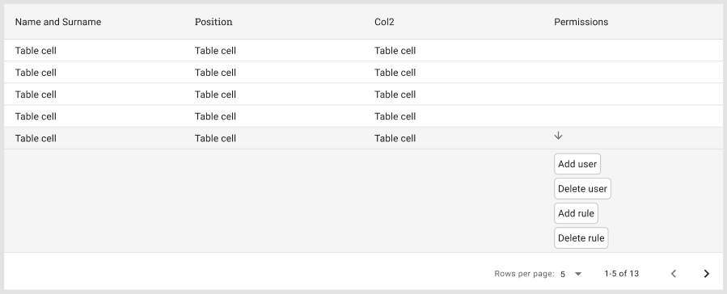

# Clowd9 recruitment task
`tables, drawers and kitchen appliance.`

# Task overview

  
Click to expand!

  1. Create a component that renders out a table using MaterialUI,
  2. if entry does have information about permissions then render it out as a custom drawer as presented in the preview below,
    
  3. display name and surname in one table column,
  4. add sorting and filtering by name and account type,
  5. take care of the pagination,
  6. you're supposed to make it look neat, show us some of the sweet styling skill you have.

 

# Q&A

  
Click to expand!

  ## How much time do I have?
  
  Around a week should do the trick. When you start working on the task let us know by forking the repo. That way we'll know when you started.

  ## How should I return the finished task?
  
  It's quite simple, just send it over to our [email](mailto:hr@clowd9.com) address.

  ## What if I have some questions regarding this whole task?
  
  You can reach us out via the email above, though we sure do hope the task is clear enough.

 

# Technical Details

  
Click to expand!

  This project was bootstrapped with [Create React App](https://github.com/facebook/create-react-app).

  ## Available Scripts

  In the project directory, you can run:

  ### `yarn start`

  Runs the app in the development mode.\
  Open [http://localhost:3000](http://localhost:3000) to view it in the browser.

  The page will reload if you make edits.\
  You will also see any lint errors in the console.

  ## Learn More

  You can learn more in the [Create React App documentation](https://facebook.github.io/create-react-app/docs/getting-started).

  To learn React, check out the [React documentation](https://reactjs.org/).

  ### Code Splitting

  This section has moved here: [https://facebook.github.io/create-react-app/docs/code-splitting](https://facebook.github.io/create-react-app/docs/code-splitting)

  ### Advanced Configuration

  This section has moved here: [https://facebook.github.io/create-react-app/docs/advanced-configuration](https://facebook.github.io/create-react-app/docs/advanced-configuration)

